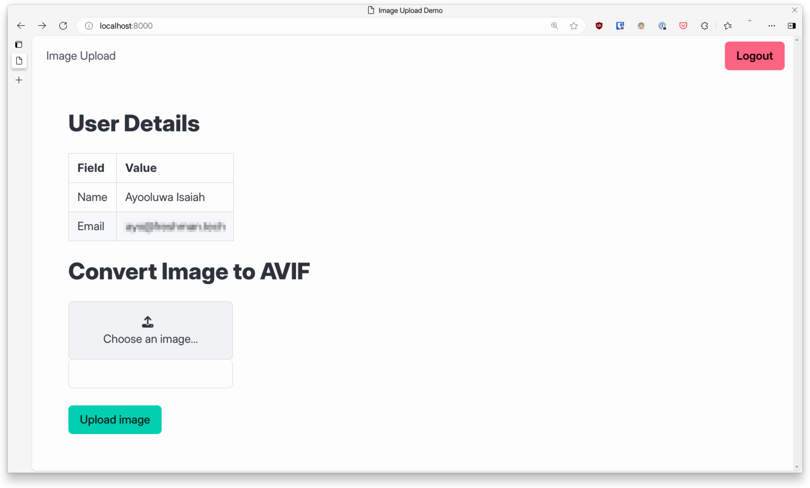

# Image Upload Demo

Learn how to instrument a Go application to emit traces using OpenTelemetry.

**Tutorial**:
[Instrumenting Go Applications with OpenTelemetry (Beginner's Guide)](https://betterstack.com/community/guides/scaling-go/opentelemetry-go)

## ⚖ License

The code used in this project and in the linked tutorial are licensed under the
[Apache License, Version 2.0](LICENSE)
